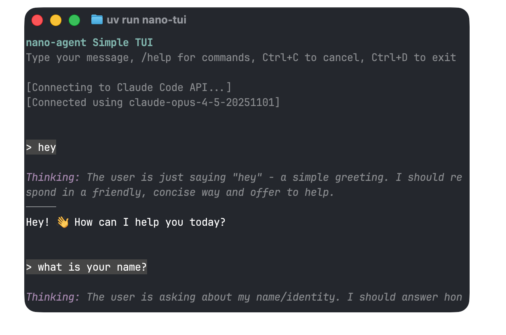

# nano agent

A minimalistic Python library for building AI agents using functional, immutable DAG operations.

## Features

**Functional & Immutable** - The DAG is immutable. Every operation returns a new instance. No hidden state, no mutations, easy to reason about.

```python
dag = DAG()
dag = dag.system("You are helpful.")  # New DAG
dag = dag.user("Hello")               # New DAG
dag = dag.assistant(response.content) # New DAG
```

**Conversation Graph** - Everything is a node in a directed acyclic graph: system prompts, messages, tool calls, results. Branch and merge for parallel tool execution.

**Built-in Tools** - `BashTool`, `ReadTool`, `WriteTool`, `EditTool`, `GlobTool`, `SearchTool`, `PythonTool`.

**Visualization** - Print any DAG to see the conversation flow, or export to HTML:

```
SYSTEM: You are helpful.
    │
    ▼
USER: What files are here?
    │
    ▼
TOOL_USE: Bash
    │
    ▼
TOOL_RESULT: file1.py, file2.py
    │
    ▼
ASSISTANT: I found 2 Python files...
```

```python
dag.save("conversation.json")  # Save the graph
```

```bash
uv run nano-agent-viewer conversation.json  # Creates conversation.html
```

**Claude Code Auth** - Reuse your Claude Code subscription. No API keys needed.

## Quick Start

```python
import asyncio
from nano_agent import ClaudeAPI, DAG, BashTool, run

async def main():
    api = ClaudeAPI()  # Uses ANTHROPIC_API_KEY
    dag = (
        DAG()
        .system("You are a helpful assistant.")
        .tools(BashTool())
        .user("What is the current date?")
    )
    dag = await run(api, dag)
    print(dag)

asyncio.run(main())
```

## Installation

```bash
git clone https://github.com/NTT123/nano_agent.git
cd nano_agent
uv pip install -e .
```

## Documentation

- [Quickstart](docs/quickstart.md)
- [Custom Tools Tutorial](docs/custom-tools-tutorial.md)
- [Configuration](docs/configuration.md)
- [Full Documentation](docs/README.md)

## nano-tui



Simple terminal UI for debugging:

```bash
uv run nano-agent-capture-auth
uv run nano-tui
```

## License

MIT
