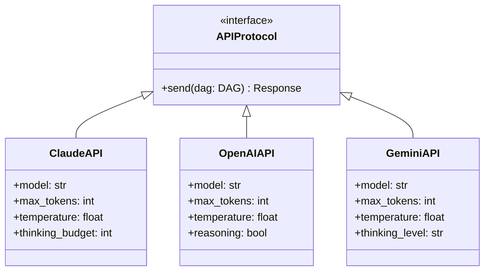

# API Clients & Extensibility

nano-agent supports multiple AI backends through a unified interface. The same DAG works with Claude, OpenAI, and Gemini—switch providers without changing your conversation logic.

## The Unified Interface

All API clients follow the same contract:

```python
class APIProtocol(Protocol):
    async def send(self, dag: DAG) -> Response: ...
```

This means you can write provider-agnostic code:

```python
from nano_agent import DAG, run

async def chat(api, user_message: str) -> str:
    """Works with any API client."""
    dag = DAG().system("You are helpful.").user(user_message)
    dag = await run(api, dag)
    return dag.head.data.content  # Get final response
```

## Available Backends



## ClaudeAPI

### Basic Usage

```python
from nano_agent import ClaudeAPI, DAG

# Using environment variable (recommended)
# Set ANTHROPIC_API_KEY in your environment
api = ClaudeAPI()

# Or provide API key directly
api = ClaudeAPI(api_key="sk-ant-...")
```

### Configuration Options

```python
api = ClaudeAPI(
    api_key="sk-ant-...",              # API key (or use ANTHROPIC_API_KEY env)
    model="claude-sonnet-4-20250514",  # Model to use
    max_tokens=16000,                  # Max response tokens
    temperature=1.0,                   # Sampling temperature
    thinking_budget=10000,             # Extended thinking budget
    user_id="my-app",                  # User ID for tracking
    base_url="https://api.anthropic.com/v1/messages?beta=true",
)
```

### ClaudeCodeAPI

For config-file-based authentication (uses `~/.nano-agent.json`):

```python
from nano_agent import ClaudeCodeAPI

# Uses pre-captured config from Claude CLI
api = ClaudeCodeAPI()

# Override specific parameters
api = ClaudeCodeAPI(
    model="claude-opus-4-20250514",
    max_tokens=8192,
)
```

See [Configuration](configuration.md) for config file setup.

### Sending Requests

```python
# With DAG (recommended)
response = await api.send(dag)

# With messages list (legacy)
response = await api.send(
    messages=[Message(Role.USER, "Hello")],
    tools=[BashTool()],
    system_prompt="You are helpful.",
)
```

### Response Object

```python
response = await api.send(dag)

# Access content
text = response.get_text()           # Get text content
tool_calls = response.get_tool_use() # Get tool use blocks
has_tools = response.has_tool_use()  # Check for tool calls

# Metadata
print(response.model)       # Model used
print(response.stop_reason) # Why it stopped
print(response.usage)       # Token usage
```

## OpenAIAPI

### Basic Usage

```python
from nano_agent import OpenAIAPI, DAG

# Using environment variable
# Set OPENAI_API_KEY in your environment
api = OpenAIAPI()

# Or provide API key directly
api = OpenAIAPI(api_key="sk-...")
```

### Configuration Options

```python
api = OpenAIAPI(
    api_key="sk-...",                # API key (or use OPENAI_API_KEY env)
    model="gpt-4o",                  # Model to use
    max_tokens=4096,                 # Max response tokens
    temperature=1.0,                 # Sampling temperature
    reasoning=True,                  # Enable reasoning mode (for o1/o3 models)
    parallel_tool_calls=True,        # Allow parallel tool calls
    base_url="https://api.openai.com/v1/responses",
)
```

### OpenAI-Specific Features

- **Reasoning Mode**: Extended thinking similar to Claude's thinking
- **Parallel Tool Calls**: Model can request multiple tools at once
- **Responses API**: Uses the newer Responses API format

```python
# Reasoning is captured in ThinkingContent blocks
response = await api.send(dag)
for block in response.content:
    if isinstance(block, ThinkingContent):
        print(f"Reasoning: {block.thinking}")
```

## GeminiAPI

### Basic Usage

```python
from nano_agent import GeminiAPI, DAG

# Using environment variable
# Set GEMINI_API_KEY in your environment
api = GeminiAPI()

# Or provide API key directly
api = GeminiAPI(api_key="...")
```

### Configuration Options

```python
api = GeminiAPI(
    api_key="...",                        # API key (or use GEMINI_API_KEY env)
    model="gemini-3-flash-preview",       # Model to use
    max_tokens=8192,                      # Max response tokens
    temperature=1.0,                      # Sampling temperature
    thinking_level="low",                 # "off", "low", "medium", "high"
    base_url="https://generativelanguage.googleapis.com/v1beta",
)
```

### Gemini-Specific Features

- **Thinking Levels**: Configure thinking depth (off/low/medium/high)
- **Different Role Names**: Uses "model" instead of "assistant" (handled automatically)
- **Function Calling**: Uses `functionCall`/`functionResponse` format

## Switching Providers

The beauty of the unified interface is easy provider switching:

```python
import asyncio
from nano_agent import DAG, ClaudeAPI, OpenAIAPI, GeminiAPI, run, BashTool

async def main():
    # Same DAG works with all providers
    dag = (
        DAG()
        .system("You are a helpful coding assistant.")
        .tools(BashTool())
        .user("List Python files in the current directory")
    )

    # Pick your provider
    providers = {
        "claude": ClaudeAPI(),
        "openai": OpenAIAPI(),
        "gemini": GeminiAPI(),
    }

    api = providers["claude"]  # Or "openai" or "gemini"

    dag = await run(api, dag)
    print(dag)

asyncio.run(main())
```

## DAG is API-Agnostic

The DAG contains no API-specific information:

```python
dag = (
    DAG()
    .system("You are helpful.")
    .tools(my_tool)
    .user("Hello")
)

# This DAG can be sent to any API
await claude_api.send(dag)
await openai_api.send(dag)
await gemini_api.send(dag)
```

Each API client handles the translation:

| nano-agent | Claude | OpenAI | Gemini |
|------------|--------|--------|--------|
| `Message(Role.ASSISTANT, ...)` | `role: "assistant"` | `role: "assistant"` | `role: "model"` |
| `ToolUseContent` | `tool_use` | `function_call` | `functionCall` |
| `ToolResultContent` | `tool_result` | `function_call_output` | `functionResponse` |
| `ThinkingContent` | `thinking` | `reasoning` | `thought` |

## Adding a New Backend

To add support for a new API provider:

1. Create a new client class
2. Implement the `send(dag)` method
3. Convert DAG to provider format
4. Parse response to `Response` object

```python
class MyNewAPI:
    def __init__(self, api_key: str, model: str = "default"):
        self.api_key = api_key
        self.model = model
        self._client = httpx.AsyncClient()

    async def send(
        self,
        messages: list[Message] | DAG,
        tools: Sequence[Tool] | None = None,
        system_prompt: str | None = None,
    ) -> Response:
        # Handle DAG input
        if isinstance(messages, DAG):
            dag = messages
            messages = dag.to_messages()
            tools = list(dag._tools or [])
            system_prompt = dag.get_system_prompt()

        # Convert to provider format
        request_body = self._convert_request(messages, tools, system_prompt)

        # Send request
        response = await self._client.post(
            self.base_url,
            headers={"Authorization": f"Bearer {self.api_key}"},
            json=request_body,
        )

        # Parse response
        return self._parse_response(response.json())

    def _convert_request(self, messages, tools, system_prompt) -> dict:
        # Convert to provider-specific format
        ...

    def _parse_response(self, data: dict) -> Response:
        # Parse to nano-agent Response
        content = []
        for item in data.get("output", []):
            if item["type"] == "text":
                content.append(TextContent(text=item["text"]))
            elif item["type"] == "tool_call":
                content.append(ToolUseContent(...))

        return Response(
            id=data["id"],
            model=self.model,
            role=Role.ASSISTANT,
            content=content,
            stop_reason=data.get("finish_reason"),
            usage=Usage(...),
        )
```

## Summary

| Provider | Env Variable | Default Model | Special Features |
|----------|--------------|---------------|------------------|
| `ClaudeAPI` | `ANTHROPIC_API_KEY` | `claude-sonnet-4-20250514` | Extended thinking, prompt caching |
| `ClaudeCodeAPI` | Config file | (from config) | Pre-captured auth from Claude CLI |
| `OpenAIAPI` | `OPENAI_API_KEY` | `gpt-4o` | Reasoning mode, parallel tools |
| `GeminiAPI` | `GEMINI_API_KEY` | `gemini-2.0-flash` | Thinking levels |

## See Also

- [Configuration](configuration.md) - Authentication setup and config files
- [Quickstart](quickstart.md) - Getting started with API clients

---

**Next:** [Data Structures](data-structures.md) - Type reference
