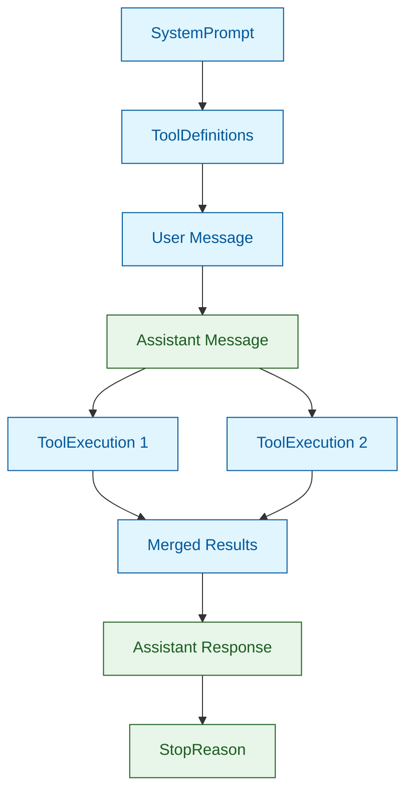
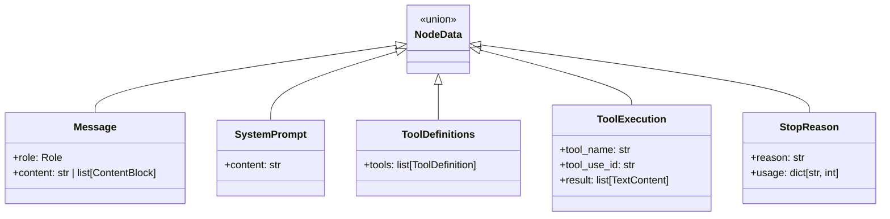
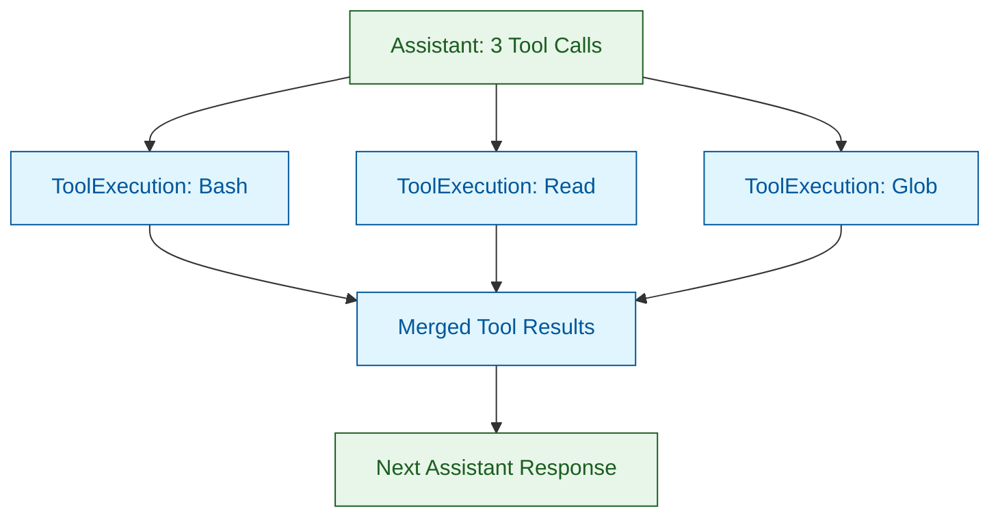

# Core Architecture

nano-agent implements a **node-based conversation graph** architecture. This document explains the fundamental design decisions and how everything fits together.

## Design Philosophy

### Functional & Immutable

The DAG is immutable—all operations return **new** DAG instances. The original is never modified:

```python
dag = DAG()
dag = dag.system("...")   # Returns NEW DAG
dag = dag.user("...")     # Returns NEW DAG
dag = dag.assistant(...)  # Returns NEW DAG
```

**Why immutability?**
- **Thread safety**: No race conditions when sharing DAGs
- **Time travel**: Keep references to any point in conversation history
- **Debugging**: Compare DAG states before and after operations
- **Branching**: Create parallel conversation branches without conflicts

### Separation of Concerns

The framework has a clear boundary:

| Framework Manages | You Manage |
|-------------------|------------|
| Graph structure | Tool execution (side effects) |
| Node traversal | External state |
| Serialization | Mutable application state |
| API communication | Business logic |

Tools define their schema for the API **and** implement `__call__` for execution. But the framework never executes tools—you call them explicitly, keeping side effects outside the DAG.

```python
# Framework provides the tool call data
tool_calls = response.get_tool_use()

# YOU execute (outside the DAG)
result = await my_tool(tool_call.input)

# Framework records the result
dag = dag.tool_result(ToolResultContent(...))
```

## Node-Based Conversation Graph

### Everything is a Node

The fundamental insight: every element in a conversation can be represented as a node in a directed acyclic graph.



> **Color Legend:**
> - 🔵 **Blue nodes**: User/Local side (SystemPrompt, User Message, Tool Execution, Tool Results)
> - 🟢 **Green nodes**: Assistant/Remote side (Assistant Message, Assistant Response, StopReason)

**Node types:**
- **SystemPrompt**: Instructions for the model
- **ToolDefinitions**: Available tools and their schemas
- **Message**: User or assistant messages
- **ToolExecution**: Visual representation of tool calls (for debugging)
- **StopReason**: Why the conversation ended

### The Node Class

```python
@dataclass(frozen=True)
class Node:
    parents: tuple["Node", ...]      # Immutable parent references
    data: NodeData                   # The actual content
    id: str                          # Unique identifier
    timestamp: float                 # Creation time
    metadata: dict[str, Any]         # Usage stats, model info, etc.
```

Key design decisions:

1. **`frozen=True`**: Nodes are immutable after creation
2. **`tuple` for parents**: Immutable, hashable, supports multiple parents (merging)
3. **Metadata dict**: Captures usage stats, stop reasons, model info

### NodeData Union Type

The `data` field contains one of several types:



This union type provides exhaustive pattern matching:

```python
def process_node(node: Node) -> str:
    match node.data:
        case SystemPrompt(content=text):
            return f"System: {text}"
        case Message(role=Role.USER, content=content):
            return f"User: {content}"
        case Message(role=Role.ASSISTANT, content=content):
            return f"Assistant: {content}"
        case ToolExecution(tool_name=name):
            return f"Executed: {name}"
        case StopReason(reason=r):
            return f"Stopped: {r}"
```

## Graph Traversal

### ancestors()

Returns all ancestor nodes in **causal order** (parents before children):

```python
# Get all nodes leading to current position
all_nodes = node.ancestors()
```

The traversal is depth-first, visiting each node only once:

```python
def ancestors(self) -> list[Node]:
    result: list[Node] = []
    visited: set[str] = set()

    def visit(node: Node) -> None:
        if node.id in visited:
            return
        visited.add(node.id)
        for parent in node.parents:
            visit(parent)
        result.append(node)

    visit(self)
    return result
```

### to_messages()

Extracts only Message nodes for API calls:

```python
messages = node.to_messages()  # List[Message] for API
```

### get_system_prompt()

Concatenates all SystemPrompt nodes:

```python
system = node.get_system_prompt()  # Combined system prompt string
```

### get_tools()

Extracts tool definitions:

```python
tools = node.get_tools()  # List of tool definition dicts
```

## Branching and Merging

When Claude makes **multiple tool calls in parallel**, the graph branches and merges:



**Creating branches:**

```python
# Each tool execution creates a branch node
result_nodes = []
for tool_call in tool_calls:
    result_node = tool_use_head.child(
        ToolExecution(
            tool_name=tool_call.name,
            tool_use_id=tool_call.id,
            result=[result_content],
        )
    )
    result_nodes.append(result_node)
```

**Merging branches:**

```python
# Merge all branches into one node
merged = Node.with_parents(
    result_nodes,  # Multiple parents!
    Message(Role.USER, tool_results),
)
```

This creates the visual "fan-out, fan-in" pattern while maintaining the correct API message sequence.

## Type Safety

The codebase uses strict mypy typing:

```python
# Frozen dataclasses prevent mutation
@dataclass(frozen=True)
class Node:
    ...

# String enums for safety
class Role(str, Enum):
    USER = "user"
    ASSISTANT = "assistant"

# Union types for content blocks
ContentBlock = TextContent | ThinkingContent | ToolUseContent | ToolResultContent

# Full type annotations
def to_messages(self) -> list[Message]:
    ...
```

Benefits:
- Catch errors at development time
- IDE autocompletion
- Self-documenting code
- Refactoring safety

## Summary

| Concept | Implementation |
|---------|---------------|
| Immutability | Frozen dataclasses, tuple |
| Graph structure | Node with parents tuple |
| Content types | NodeData union type |
| Traversal | ancestors(), to_messages(), etc. |
| Branching | Multiple children from one parent |
| Merging | Node.with_parents() |
| Type safety | mypy strict mode, Enums, Union types |

---

**Next:** [DAG Builder](dag-builder.md) - The fluent API for constructing graphs
