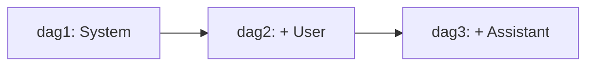
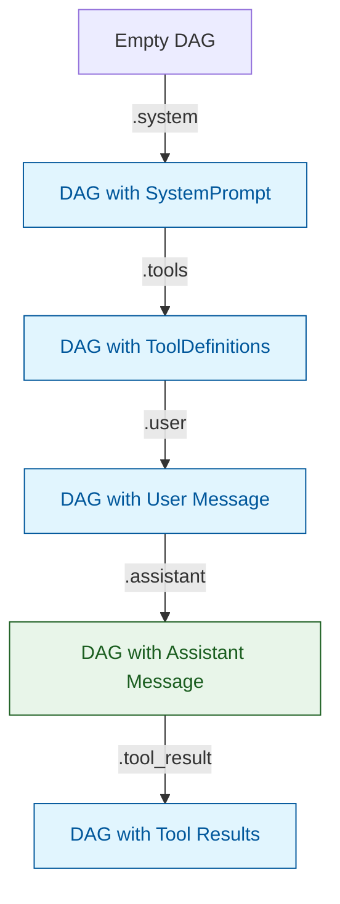

# DAG Builder Pattern

The `DAG` class provides a fluent, high-level interface for constructing conversation graphs. While `Node` is the fundamental primitive, `DAG` makes common operations ergonomic.

## Why a Builder?

Working directly with `Node` is powerful but verbose:

```python
# Direct Node usage (low-level)
node = Node.system("You are helpful.")
node = node.tools(BashTool(), ReadTool())
node = node.child(Message(Role.USER, "Hello"))
node = node.child(Message(Role.ASSISTANT, "Hi!"))
```

The `DAG` builder provides a cleaner API:

```python
# DAG builder (high-level)
dag = (
    DAG()
    .system("You are helpful.")
    .tools(BashTool(), ReadTool())
    .user("Hello")
    .assistant("Hi!")
)
```

## Immutability Guarantee

**Every DAG method returns a new DAG instance.** The original is never modified:

```python
dag1 = DAG().system("You are helpful.")
dag2 = dag1.user("Hello")       # dag1 unchanged!
dag3 = dag2.assistant("Hi!")    # dag1 and dag2 unchanged!

# All three DAGs exist independently
print(dag1)  # Just system prompt
print(dag2)  # System + user
print(dag3)  # System + user + assistant
```



## Core Builder Methods

### system()

Add system prompt instructions:

```python
dag = DAG().system("You are a helpful assistant.")

# Multiple system prompts are concatenated
dag = (
    DAG()
    .system("You are Claude Code.")
    .system("Always explain your reasoning.")
)
```

### tools()

Add tool definitions:

```python
from nano_agent import BashTool, ReadTool, EditTool

dag = DAG().system("...").tools(BashTool(), ReadTool(), EditTool())
```

Tools are stored for:
1. API serialization (schemas sent to the model)
2. Automatic execution via `execute_tools()` or `run()`

### user()

Add user messages:

```python
# String content
dag = dag.user("What is 2 + 2?")

# Content blocks
dag = dag.user(TextContent(text="Hello"), ToolResultContent(...))

# List of blocks (backward compatible)
dag = dag.user(response.content)
```

### assistant()

Add assistant messages:

```python
# String content
dag = dag.assistant("The answer is 4.")

# From API response
dag = dag.assistant(response.content)

# With tool calls
dag = dag.assistant([TextContent(text="Let me check..."), tool_use_block])
```

### tool_result()

Add tool results:

```python
dag = dag.tool_result(
    ToolResultContent(tool_use_id="call_123", content=[TextContent(text="Done")])
)

# Multiple results
dag = dag.tool_result(result1, result2, result3)
```

### execute_tools()

High-level helper that executes tools and updates the graph automatically:

```python
def handle_tool(call: ToolUseContent) -> TextContent:
    if call.name == "Bash":
        return bash_tool(call.input)
    elif call.name == "Read":
        return read_tool(call.input)
    return TextContent(text=f"Unknown tool: {call.name}")

dag = dag.execute_tools(response.get_tool_use(), handle_tool)
```

This method replaces 30+ lines of manual boilerplate:
1. Adds assistant message with tool calls
2. Merges all results into a single node

### add_response()

Intelligently adds an API response to the graph:

```python
# Without tool handler - adds response, you handle tools manually
dag = dag.add_response(response)

# With tool handler - automatic tool execution
dag = dag.add_response(response, handle_tool)
```

The method:
- Extracts text/thinking blocks → adds as assistant message
- If tool_handler provided and response has tool calls → executes tools automatically
- Otherwise → adds tool calls for manual handling

### add_stop_reason()

Add a stop reason node for visualization:

```python
dag = dag.add_stop_reason(response)
```

This adds a terminal node showing:
- Why the conversation ended (`end_turn`, `max_tokens`, etc.)
- Cumulative token usage

## Complete Conversation Flow

Here's a typical conversation with tool use:

```python
import asyncio
from nano_agent import DAG, ClaudeAPI, BashTool, TextContent, ToolResultContent

async def main():
    bash = BashTool()
    api = ClaudeAPI()

    # 1. Build initial DAG
    dag = (
        DAG()
        .system("You are a helpful assistant.")
        .tools(bash)
        .user("What files are in the current directory?")
    )

    # 2. Get response
    response = await api.send(dag)
    dag = dag.assistant(response.content)

    # 3. Handle tool calls
    tool_calls = response.get_tool_use()
    for call in tool_calls:
        # Execute tool
        result = await bash(call.input)

        # Add result to DAG
        dag = dag.tool_result(
            ToolResultContent(
                tool_use_id=call.id,
                content=[result],
            )
        )

    # 4. Get final response
    response = await api.send(dag)
    dag = dag.assistant(response.content)

    print(response.get_text())

asyncio.run(main())
```

## State Transformations

Each method transforms the DAG state:



## Accessing DAG State

### head Property

Get the single head node:

```python
node = dag.head  # The current "tip" of the conversation
```

Raises `ValueError` if multiple heads exist (use `.heads` instead).

### heads Property

Get all head nodes (for parallel branches):

```python
heads = dag.heads  # tuple[Node, ...]
```

### to_messages()

Extract messages for API calls:

```python
messages = dag.to_messages()  # list[Message]
```

### get_system_prompt()

Get concatenated system prompt:

```python
system = dag.get_system_prompt()  # str
```

### get_tools()

Get tool definitions:

```python
tools = dag.get_tools()  # list[dict]
```

## Visualization

The DAG has a built-in `__str__` method for console visualization:

```python
print(dag)
```

Output:
```
  SYSTEM: You are a helpful assistant.
      |
      v
  TOOLS: Bash, Read
      |
      v
  USER: What files are here?
      |
      v
  TOOL_USE: Bash
      |
      v
  RESULT: file1.txt, file2.py, ...
      |
      v
  ASSISTANT: The directory contains...
      |
      v
  STOP: end_turn
```

## Advanced: Internal Structure

The DAG class is itself a frozen dataclass:

```python
@dataclass(frozen=True)
class DAG:
    _heads: tuple[Node, ...]      # Current head nodes
    _tools: tuple[Tool, ...] | None = None  # Registered tools
```

Internal helper methods:
- `_with_heads()`: Create new DAG with updated heads
- `_append_to_heads()`: Add data to all current heads

## Summary

| Method | Purpose | Returns |
|--------|---------|---------|
| `system(prompt)` | Add system instruction | New DAG |
| `tools(*tools)` | Add tool definitions | New DAG |
| `user(content)` | Add user message | New DAG |
| `assistant(content)` | Add assistant message | New DAG |
| `tool_result(*results)` | Add tool results | New DAG |
| `execute_tools(calls, handler)` | Execute tools and update graph automatically | New DAG |
| `add_response(response, handler?)` | Add API response with optional tool handling | New DAG |
| `add_stop_reason(response)` | Add stop reason node for visualization | New DAG |
| `save(path)` | Save to JSON | None |
| `DAG.load(path)` | Load from JSON | (DAG, metadata) |

---

**Next:** [Tools](tools.md) - Creating and using tools
