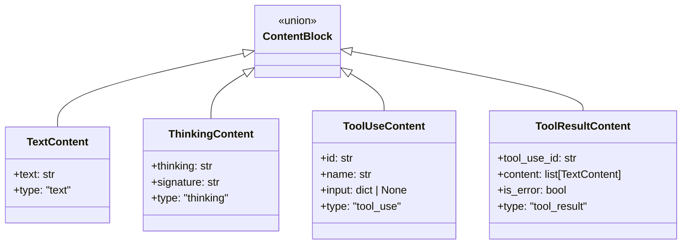

# Data Structures Reference

This document provides a complete reference for all data structures in nano-agent. All structures are frozen dataclasses with full type annotations.

## Content Blocks

Content blocks represent the building blocks of message content. They form a union type:

```python
ContentBlock = TextContent | ThinkingContent | ToolUseContent | ToolResultContent
```



### TextContent

Plain text content from user or assistant:

```python
@dataclass(frozen=True)
class TextContent:
    text: str
    type: str = "text"  # Auto-set, not in __init__

# Usage
content = TextContent(text="Hello, world!")
print(content.text)      # "Hello, world!"
print(content.to_dict()) # {"type": "text", "text": "Hello, world!"}
```

### ThinkingContent

Model's reasoning/thinking (extended thinking, chain of thought):

```python
@dataclass(frozen=True)
class ThinkingContent:
    thinking: str           # The thinking text
    signature: str = ""     # Claude signature (for verification)
    # OpenAI-specific fields
    id: str = ""
    encrypted_content: str = ""
    summary: tuple[dict, ...] = ()
    type: str = "thinking"

# Usage
thinking = ThinkingContent(
    thinking="Let me think about this step by step...",
    signature="abc123",
)
```

### ToolUseContent

Tool/function call from the assistant:

```python
@dataclass(frozen=True)
class ToolUseContent:
    id: str                        # Unique call ID
    name: str                      # Tool name
    input: dict[str, Any] | None   # Tool parameters
    item_id: str | None = None     # OpenAI-specific
    type: str = "tool_use"

# Usage
tool_call = ToolUseContent(
    id="call_abc123",
    name="Bash",
    input={"command": "ls -la"},
)

# Access fields
print(tool_call.name)   # "Bash"
print(tool_call.input)  # {"command": "ls -la"}
```

### ToolResultContent

Result of a tool execution:

```python
@dataclass(frozen=True)
class ToolResultContent:
    tool_use_id: str              # Correlates with ToolUseContent.id
    content: list[TextContent]    # Result content
    is_error: bool = False        # Whether this is an error result
    type: str = "tool_result"

# Usage
result = ToolResultContent(
    tool_use_id="call_abc123",
    content=[TextContent(text="file1.txt\nfile2.py")],
)

# Error result
error_result = ToolResultContent(
    tool_use_id="call_abc123",
    content=[TextContent(text="Permission denied")],
    is_error=True,
)
```

## Message

A conversation message (user or assistant):

```python
@dataclass(frozen=True)
class Message:
    role: Role
    content: str | Sequence[ContentBlock]

# Usage
user_msg = Message(role=Role.USER, content="Hello")
assistant_msg = Message(
    role=Role.ASSISTANT,
    content=[
        TextContent(text="Let me help you."),
        ToolUseContent(id="call_1", name="Bash", input={"command": "ls"}),
    ],
)
```

### Role Enum

```python
class Role(str, Enum):
    USER = "user"
    ASSISTANT = "assistant"
```

## Node Data Types

Node data represents what a node contains:

```python
NodeData = Message | SystemPrompt | ToolDefinitions | ToolExecution | StopReason
```

### SystemPrompt

System instructions for the model:

```python
@dataclass(frozen=True)
class SystemPrompt:
    content: str
    type: str = "system_prompt"

# Usage
prompt = SystemPrompt(content="You are a helpful assistant.")
```

### ToolDefinition

Single tool definition:

```python
@dataclass(frozen=True)
class ToolDefinition:
    name: str
    description: str
    input_schema: dict[str, Any]

# Usage
tool_def = ToolDefinition(
    name="calculator",
    description="Evaluate math expressions",
    input_schema={
        "type": "object",
        "properties": {
            "expression": {"type": "string"}
        },
        "required": ["expression"],
    },
)
```

### ToolDefinitions

Collection of tool definitions:

```python
@dataclass(frozen=True)
class ToolDefinitions:
    tools: list[ToolDefinition]
    type: str = "tool_definitions"
```

### ToolExecution

Visual representation of tool execution (for debugging):

```python
@dataclass(frozen=True)
class ToolExecution:
    tool_name: str
    tool_use_id: str
    result: list[TextContent]
    is_error: bool = False
    type: str = "tool_execution"

# Usage (created by the framework)
exec_node = ToolExecution(
    tool_name="Bash",
    tool_use_id="call_abc123",
    result=[TextContent(text="file1.txt")],
)
```

**Note:** ToolExecution nodes are for visualization only. They are NOT sent to the API.

### StopReason

Why the conversation ended:

```python
@dataclass(frozen=True)
class StopReason:
    reason: str                    # "end_turn", "max_tokens", etc.
    usage: dict[str, int] = {}     # Cumulative token usage
    type: str = "stop_reason"

# Usage
stop = StopReason(
    reason="end_turn",
    usage={
        "input_tokens": 150,
        "output_tokens": 50,
        "cache_read_input_tokens": 100,
    },
)
```

## Response

API response object:

```python
class Response:
    id: str
    model: str
    role: Role
    content: list[ContentBlock]
    stop_reason: str | None
    usage: Usage

    def get_text(self) -> str:
        """Extract text content."""

    def get_tool_use(self) -> list[ToolUseContent]:
        """Extract tool use blocks."""

    def has_tool_use(self) -> bool:
        """Check for tool calls."""
```

### Usage

Token usage statistics:

```python
@dataclass
class Usage:
    input_tokens: int = 0
    output_tokens: int = 0
    cache_creation_input_tokens: int = 0
    cache_read_input_tokens: int = 0

# Usage
usage = Usage(input_tokens=100, output_tokens=50)
print(usage.to_dict())
```

## Todo System

For task tracking with TodoWriteTool:

### TodoItem

```python
@dataclass(frozen=True)
class TodoItem:
    content: str
    status: TaskStatus
    active_form: str  # Present continuous, e.g., "Running tests"
```

### TaskStatus Enum

```python
class TaskStatus(str, Enum):
    PENDING = "pending"
    IN_PROGRESS = "in_progress"
    COMPLETED = "completed"
```

### Todo (Tool State)

```python
@dataclass
class Todo:
    content: str
    status: TodoStatus
    active_form: str

    @classmethod
    def from_dict(cls, data: dict) -> "Todo": ...
    def to_dict(self) -> dict: ...
```

## Type Safety Patterns

### Pattern Matching

```python
def process_content(block: ContentBlock) -> str:
    match block:
        case TextContent(text=t):
            return f"Text: {t}"
        case ThinkingContent(thinking=t):
            return f"Thinking: {t}"
        case ToolUseContent(name=n, input=i):
            return f"Tool: {n}({i})"
        case ToolResultContent(content=c):
            return f"Result: {c}"
```

### Type Guards

```python
from typing import TypeGuard

def is_tool_call(block: ContentBlock) -> TypeGuard[ToolUseContent]:
    return isinstance(block, ToolUseContent)

# Usage
for block in response.content:
    if is_tool_call(block):
        # block is narrowed to ToolUseContent
        print(block.name)
```

### Union Type Checking

```python
def handle_node_data(data: NodeData) -> None:
    if isinstance(data, Message):
        print(f"Message from {data.role}")
    elif isinstance(data, SystemPrompt):
        print(f"System: {data.content}")
    elif isinstance(data, ToolDefinitions):
        print(f"Tools: {[t.name for t in data.tools]}")
    elif isinstance(data, ToolExecution):
        print(f"Executed: {data.tool_name}")
    elif isinstance(data, StopReason):
        print(f"Stopped: {data.reason}")
```

## Serialization

All dataclasses support `to_dict()` for JSON serialization:

```python
content = TextContent(text="Hello")
data = content.to_dict()
# {"type": "text", "text": "Hello"}

message = Message(Role.USER, "Hello")
data = message.to_dict()
# {"role": "user", "content": "Hello"}
```

And `from_dict()` for deserialization:

```python
content = TextContent.from_dict({"type": "text", "text": "Hello"})
```

## Tool State Types

These types manage internal tool state.

### PendingEdit

Stores a pending edit awaiting confirmation from EditConfirmTool:

```python
@dataclass
class PendingEdit:
    file_path: str              # Target file
    old_string: str             # Text to replace
    new_string: str             # Replacement text
    match_line: int             # Line number of match
    context_before: list[str]   # Lines before match
    context_after: list[str]    # Lines after match
    created_at: float           # Unix timestamp
    replace_all: bool = False   # Replace all occurrences
    match_count: int = 1        # Number of matches
```

### TruncationConfig

Configuration for tool output truncation:

```python
@dataclass
class TruncationConfig:
    max_chars: int = 30000    # Max characters before truncation
    max_lines: int = 1000     # Max lines before truncation
    enabled: bool = True      # Whether truncation is active
```

Used as a class variable on tools:

```python
@dataclass
class MyTool(Tool):
    _truncation_config: ClassVar[TruncationConfig] = TruncationConfig(
        max_chars=5000,
        enabled=True
    )
```

### TruncatedOutput

Metadata about a truncated tool output:

```python
@dataclass
class TruncatedOutput:
    tool_name: str          # Tool that produced output
    temp_file_path: str     # Path to full output
    original_chars: int     # Original character count
    original_lines: int     # Original line count
    created_at: float       # Unix timestamp
```

### PythonScript

Tracks a Python script file for PythonTool:

```python
@dataclass
class PythonScript:
    file_id: str               # Unique identifier (e.g., "py_abc123")
    file_path: str             # Absolute path to script
    content: str               # Script content
    created_at: float          # Unix timestamp
    last_run_at: float | None = None  # Last run timestamp
    run_count: int = 0         # Number of times run
```

## Summary Table

| Type | Purpose | Key Fields |
|------|---------|------------|
| `TextContent` | Plain text | `text` |
| `ThinkingContent` | Model reasoning | `thinking`, `signature` |
| `ToolUseContent` | Tool call | `id`, `name`, `input` |
| `ToolResultContent` | Tool result | `tool_use_id`, `content`, `is_error` |
| `Message` | Conversation message | `role`, `content` |
| `SystemPrompt` | System instructions | `content` |
| `ToolDefinitions` | Available tools | `tools` |
| `ToolExecution` | Execution record | `tool_name`, `result` |
| `StopReason` | End marker | `reason`, `usage` |
| `Response` | API response | `content`, `stop_reason`, `usage` |
| `Usage` | Token counts | `input_tokens`, `output_tokens` |
| `PendingEdit` | Edit awaiting confirmation | `file_path`, `old_string`, `new_string` |
| `TruncationConfig` | Truncation settings | `max_chars`, `max_lines`, `enabled` |
| `TruncatedOutput` | Truncated output metadata | `temp_file_path`, `original_chars` |
| `PythonScript` | Python script tracking | `file_id`, `file_path`, `content` |

---

**Next:** [Serialization](serialization.md) - Saving, loading, and visualizing graphs
