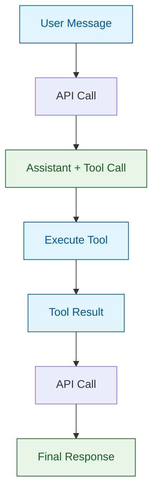
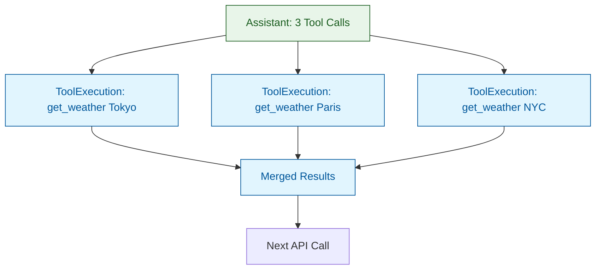

# Tool Execution Patterns

This document covers how to execute tools and handle their results, from simple single-tool flows to complex parallel execution patterns.

## Single Tool Execution

The basic pattern for handling a tool call:

```python
# 1. Send request and get response
response = await api.send(dag)
dag = dag.assistant(response.content)

# 2. Check for tool calls
tool_calls = response.get_tool_use()

if tool_calls:
    # 3. Execute each tool
    for call in tool_calls:
        # Find and execute the tool
        result = await my_tool(call.input)

        # 4. Add result to DAG
        dag = dag.tool_result(
            ToolResultContent(
                tool_use_id=call.id,
                content=[result],
            )
        )

    # 5. Continue conversation
    response = await api.send(dag)
    dag = dag.assistant(response.content)
```



## The execute_tools() Method

The `execute_tools()` method automates the branching and merging:

```python
def handle_tool(call: ToolUseContent) -> TextContent:
    """Execute a single tool call."""
    if call.name == "calculator":
        return calculator(call.input)
    elif call.name == "weather":
        return get_weather(call.input)
    raise ValueError(f"Unknown tool: {call.name}")

# Automatic execution with proper graph structure
dag = dag.execute_tools(response.get_tool_use(), handle_tool)
```

This method:
1. Adds the assistant message with tool calls
2. Executes your handler for each tool
3. Merges results into a single node

## Parallel Tool Execution

When the model requests multiple tools simultaneously, nano-agent creates a branching graph structure:



### Manual Parallel Execution

```python
from nano_agent import Node, Message, Role, ToolExecution, ToolResultContent

# After getting response with multiple tool calls
tool_calls = response.get_tool_use()
dag = dag.assistant(response.content)

# Save head before branching
tool_use_head = dag.head

# Execute tools and create branch nodes
result_nodes = []
tool_results = []

for call in tool_calls:
    # Execute the tool
    result = await tools[call.name](call.input)
    result_list = result if isinstance(result, list) else [result]

    # Create branch node for visualization
    result_node = tool_use_head.child(
        ToolExecution(
            tool_name=call.name,
            tool_use_id=call.id,
            result=result_list,
        )
    )
    result_nodes.append(result_node)

    # Collect results for API
    tool_results.append(
        ToolResultContent(
            tool_use_id=call.id,
            content=result_list,
        )
    )

# Merge all branches
merged = Node.with_parents(
    result_nodes,
    Message(Role.USER, tool_results),
    scope=dag._scope,
)
dag = dag._with_heads((merged,))
```

### Using the run() Executor

The `run()` function handles the entire agent loop:

```python
from nano_agent import DAG, ClaudeAPI, run

async def main():
    api = ClaudeAPI()

    dag = (
        DAG()
        .system("You are helpful.")
        .tools(calculator, weather)
        .user("What's 2+2 and the weather in Tokyo?")
    )

    # Run until stop_reason (handles all tool calls automatically)
    dag = await run(api, dag)

    print(dag)
```

The `run()` executor:
1. Sends requests to the API
2. Adds responses to the DAG
3. Executes tool calls using `dag._tools`
4. Creates proper branch/merge structure
5. Loops until a stop reason is received
6. Adds a StopReason node at the end

## Graph Structure Details

### ToolExecution Nodes (Visualization Only)

`ToolExecution` nodes exist for debugging and visualization. They show:
- Which tool was called
- The tool_use_id for correlation
- The result content

```python
@dataclass(frozen=True)
class ToolExecution:
    tool_name: str           # "Bash", "Read", etc.
    tool_use_id: str         # Correlates with ToolUseContent
    result: list[TextContent]
    is_error: bool = False
```

**Important:** ToolExecution nodes are NOT sent to the API. They're purely for graph visualization.

### What the API Sees

The API receives a simplified message sequence:

```
User: "List files"
Assistant: [tool_use: Bash with {command: "ls"}]
User: [tool_result: "file1.txt\nfile2.py"]
Assistant: "I found 2 files..."
```

The branching structure is internal to nano-agent.

## Complete Example: Multi-City Weather

```python
import asyncio
from dataclasses import dataclass
from typing import Annotated, Any

from nano_agent import (
    DAG,
    OpenAIAPI,
    Tool,
    TextContent,
    Desc,
    schema_field,
    run,
)

@dataclass
class CityInput:
    city: Annotated[str, Desc("City name")]

@dataclass
class GetWeather(Tool):
    name: str = "get_weather"
    description: str = "Get weather for ONE city. Call separately for each city."

    async def __call__(self, input: CityInput) -> TextContent:
        weather = {"Tokyo": "22°C", "Paris": "18°C", "NYC": "25°C"}
        return TextContent(text=f"{input.city}: {weather.get(input.city, 'Unknown')}")

async def main():
    api = OpenAIAPI()  # Or ClaudeAPI(), GeminiAPI()

    dag = (
        DAG()
        .system("You help with weather. Call tools in parallel when possible.")
        .tools(GetWeather())
        .user("What's the weather in Tokyo, Paris, and NYC?")
    )

    # This will:
    # 1. Model requests 3 parallel tool calls
    # 2. Executor creates branch structure
    # 3. Executes all three
    # 4. Merges results
    # 5. Model gives final answer
    dag = await run(api, dag)

    print(dag)
    dag.save("weather.json")

asyncio.run(main())
```

## Execution Patterns Comparison

| Pattern | Use Case | Code |
|---------|----------|------|
| Manual | Full control, custom logic | `for call in calls: ...` |
| `execute_tools()` | Automatic branching, custom handler | `dag.execute_tools(calls, handler)` |
| `run()` | Full agent loop | `dag = await run(api, dag)` |

## Error Handling in Execution

### Catching Tool Errors

```python
async def safe_handler(call: ToolUseContent) -> TextContent:
    try:
        tool = tools.get(call.name)
        if not tool:
            return TextContent(text=f"Error: Unknown tool '{call.name}'")
        return await tool(call.input)
    except Exception as e:
        return TextContent(text=f"Error executing {call.name}: {e}")

dag = dag.execute_tools(tool_calls, safe_handler)
```

### Marking Errors in Results

```python
ToolResultContent(
    tool_use_id=call.id,
    content=[TextContent(text="File not found")],
    is_error=True,  # Signals error to the model
)
```

## Async Execution

All tool execution is async:

```python
async def __call__(self, input: dict | None) -> TextContent:
    # Can use async operations
    async with aiohttp.ClientSession() as session:
        async with session.get(url) as resp:
            data = await resp.json()
    return TextContent(text=str(data))
```

For concurrent execution of multiple tools:

```python
import asyncio

async def execute_parallel(tool_calls, tools):
    """Execute multiple tools concurrently."""
    tasks = [tools[call.name](call.input) for call in tool_calls]
    results = await asyncio.gather(*tasks)
    return results
```

## Summary

| Component | Purpose |
|-----------|---------|
| `response.get_tool_use()` | Extract tool calls from response |
| `ToolExecution` | Visualization node (not sent to API) |
| `ToolResultContent` | Result sent back to API |
| `execute_tools()` | Automatic branch/merge with handler |
| `run()` | Full agent loop executor |
| `Node.with_parents()` | Merge multiple branches |

---

**Next:** [API Clients](api-clients.md) - Multi-backend support
